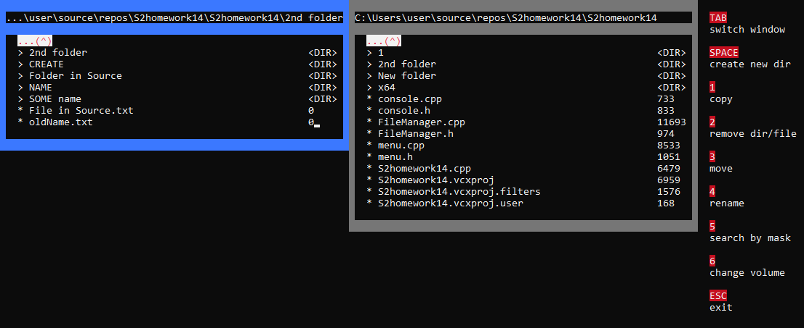
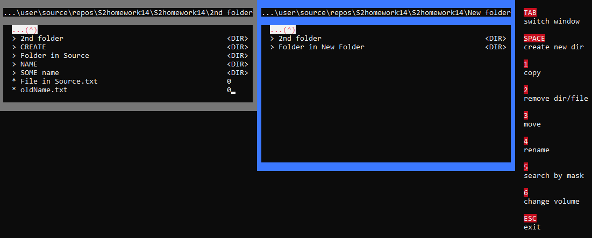

File Manager is a simle console application, that provides a basic user interface to manage files and folders.  
It can perform following operations:
- create new directory  
- copy file or directory  
- remove file or directory  
- move file or directory to another location  
- rename file or directory  
- search by mask  
- change volume (disk partition)  

File manager consists of two separate windows, each contains files and directories of chosen directory.  
To switch between windows press 'TAB' key.  
Operations of copy and move are performed between two windows (from active to nonactive).
To move between directories and files use arrow keys (UP and DOWN).  

This file manager works only under Windows platforms.  

Screenshoots of File Manager:  

  

  

